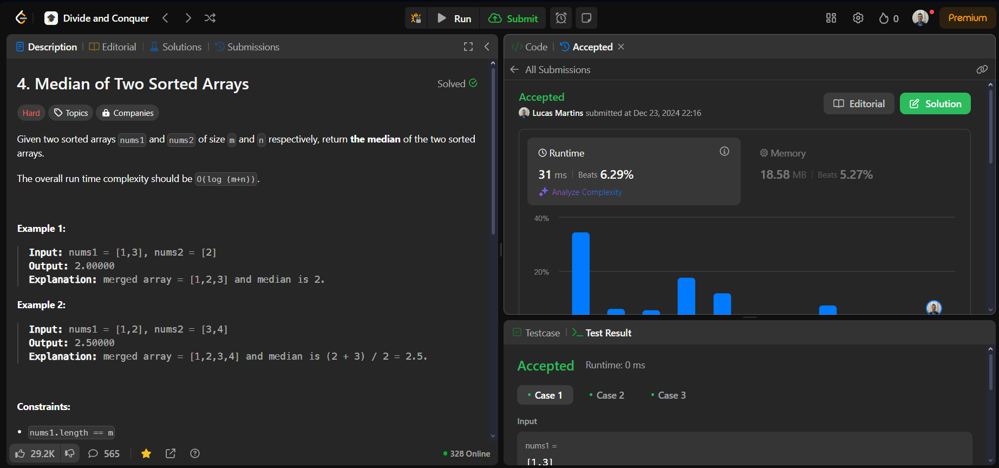

# LeetCode

**Número da Lista**: 19 
**Conteúdo da Disciplina**: Dividir e Conquistar 

## Alunos

| Matrícula | Aluno                 |
| --------- | --------------------- |
| 211061805 | Guilherme Westphall   |
| 221022088 | Lucas Martins Gabriel |

## Sobre 

O projeto consiste em resolver problemas de Dividir e Conquistar de plataformas como o LeetCode e o GeekForGeeks. O objetivo é praticar os conceitos aprendidos durante o módulo de Dividir e Conquistar.

## Questões

| Questão          | Título                                                                                                                                               | Dificuldade |
| ---------------- | ---------------------------------------------------------------------------------------------------------------------------------------------------- | ----------- |
| 23               | [Merge k Sorted Lists](https://leetcode.com/problems/merge-k-sorted-lists/)                                                                          | Hard        |
| Count Inversions | [Count Inversions](https://www.geeksforgeeks.org/problems/inversion-of-array-1587115620/1?page=1&category=Divide%20and%20Conquer&sortBy=submissions) | Medium      |
| 4                | [Median of Two Sorted Arrays](https://leetcode.com/problems/median-of-two-sorted-arrays/description/)                                                | Hard        |

## Screenshots

### Merge k Sorted Lists

### Count Inversions

### Median of Two Sorted Arrays

## Instalação 
**Linguagem**: C++ e Python 

## Uso 
Para testar as soluções basta submeter o código nas respectivas plataformas de exercícios.

## Vídeo

https://youtu.be/d3Oiazv2oCk

